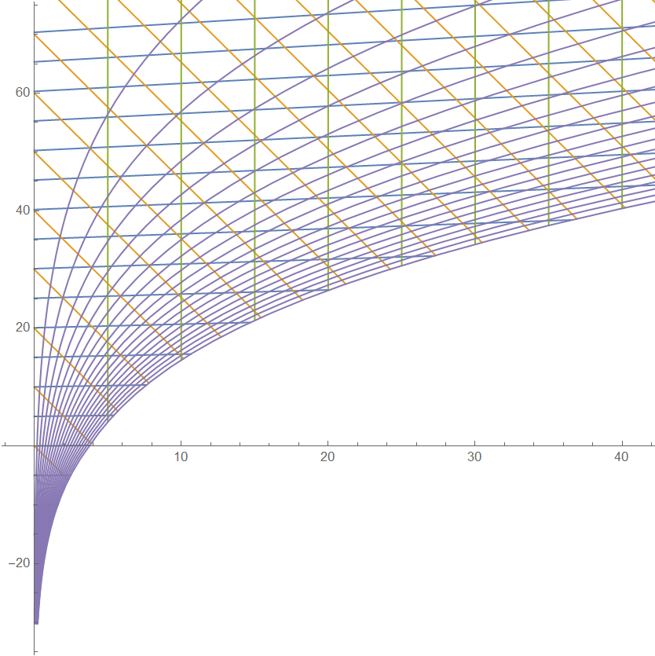

# Psychrometric

`Mathematica`语言实现的湿空气状态点计算程序

## Example

### 绘制焓湿图



### 根据任意两参数求状态点

| 变量 |     含义     |
| ---- | ------------ |
| t    | 干球温度(°C) |
| d    | 含湿量(g/kg) |
| φ    | 相对湿度(%)  |
| h    | 焓(kJ/kg)    |
| ts   | 湿球温度(°C) |
| tl   | 露点温度(°C) |

```Mathematica
pt1=psy[t->25,\[CurlyPhi]->100]
pt2=psy["h"->77,"\[CurlyPhi]"->80]


（*<|t->25,d->20.0829,\[CurlyPhi]->100,h->76.2561,ts->25.,tl->25.|>
<|t->28.0022,d->19.1485,\[CurlyPhi]->80,h->77,ts->25.1769,tl->24.2275|>*)
```

### 求两状态点混合

```Mathematica
ratio=75;(*混合比例*)

psy["h"->(pt1["h"]*ratio+pt2["h"]*(1-ratio))/100,"d"->(pt1["d"]*ratio+pt2["d"]*(1-ratio))/100]


(*<|t->-2.00542,d->0.892314,\[CurlyPhi]->28.0496,h->0.212045,ts->-5.6097,tl->-16.4011|>*)
```

### 求送风状态点

```Mathematica
\[CurlyEpsilon]=10000;(*热湿比(J/g)*)
\[CurlyPhi]l=95;(*机器露点*)

psy@@FindRoot[{dp[\[CurlyPhi]l/100Pqb[t]]==df,d==df}/.
NSolve[{(hf-pt2["h"])/(df-pt2["d"])==\[CurlyEpsilon]/1000,htd[t,df]==hf},{hf,df}][[1]],
	{{t,pt2["t"]},{d,pt2["d"]}}]


(*<|t->24.688,d->18.686,\[CurlyPhi]->95.,h->72.3752,ts->24.0545,tl->23.8324|>*)
```